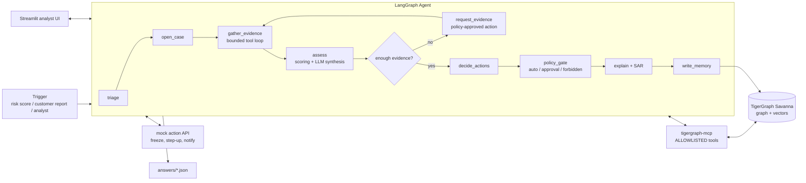

# Fraud Investigation Agent — TigerGraph HHGOA

Hackathon build. Deadline: Sept 24, 2026, 11:59 PM IST. Team of 2.
**Rule #1: all 20 benchmark answer files must exist end-to-end by hour ~20. Polish after.**

> Anything marked `TBD-README` depends on the dataset README (columns, case format,
> answer format, how "additional evidence" is supplied). Do not invent these; ask.

---

## 1. Architecture



### Layers and responsibilities

| Layer | What it does | Key rule |
|---|---|---|
| **TigerGraph** | Entities, transactions, prior cases, policy chunks (vectors), new cases | Single source of truth, including written-back cases |
| **GSQL queries** | All graph analytics: neighbourhoods, shared devices, rings, velocity, pattern detectors, similar cases | Graph does the analysis; the LLM never scans raw rows |
| **tigergraph-mcp** | Exposes graph to agent | Allowlist only (no drop/clear/delete tools) |
| **GraphRAG** | Policy/typology/regulation chunks + connected graph evidence → compact context | Pass structured briefs, not raw data |
| **Scoring** | Deterministic risk score + confidence from evidence | Reproducible; LLM explains, doesn't invent numbers |
| **Agent (LangGraph)** | Orchestrates the investigation loop, stop criteria | Max N evidence rounds; explicit stop reason |
| **Policy gate** | Maps each action → auto / needs-approval (role) / forbidden | Agent may *recommend* anything, *execute* only authorised |
| **Case memory** | Prior cases as vertices; similar-case retrieval; write-back on close | Hybrid retrieval: vector + shared entities + same pattern |
| **UI** | Case queue, timeline, evidence graph, uncertainty, NBA before/after, approve buttons | Streamlit, fastest to build |

### Core design decisions
1. **Graph for facts, rules for scores, LLM for reasoning.** Pattern detectors are GSQL; risk/confidence is Python; LLM picks tools, synthesises, explains.
2. **Uncertainty is explicit.** `confidence = f(evidence coverage, signal agreement, similar-case outcome agreement)`. Low confidence → request evidence, not guess.
3. **Two NBA snapshots per case**: `nba_before_evidence` and `nba_after_evidence`, each with approval route. (Required by submission.)
4. **Stop criteria**: confidence ≥ threshold, OR no policy-approved evidence action left, OR max rounds hit. Stop reason recorded.
5. **Every step appends to the case record** (evidence, finding, decision, action, timestamp, actor). Case written to graph at each stage.

---

## 2. Graph schema (PROVISIONAL — finalise after README)

**Entity vertices:** `Customer`, `Card`, `Transaction`, `Device`, `IP/Connection`, `EmailDomain`, `Address`
**Case/memory vertices:** `Case`, `Evidence`, `Finding`, `Action`, `Decision`, `SAR`
**Knowledge vertices:** `FraudPattern` (5 known + discovered), `PolicyChunk` (vector), `Regulation`

**Edges (examples):**
- `Customer -OWNS-> Card`, `Card -MADE-> Transaction`
- `Transaction -USED_DEVICE-> Device`, `-FROM_IP->`, `-PURCHASER_EMAIL->`, `-BILLING_ADDR->`
- `Case -ABOUT-> Customer|Transaction`, `Case -HAS_EVIDENCE-> Evidence`, `Case -HAS_ACTION-> Action`
- `Case -MATCHES-> FraudPattern`, `Case -SIMILAR_TO-> Case`
- `PolicyChunk -DESCRIBES-> FraudPattern`, `PolicyChunk -CITES-> Regulation`

**Vector attributes:** `Case.summary_emb`, `PolicyChunk.emb`

---

## 3. GSQL queries (installed)

| Query | Purpose |
|---|---|
| `entity_profile` | Customer/card baseline: spend stats, typical devices, emails, addresses |
| `txn_neighborhood(k)` | k-hop context around a transaction |
| `shared_entities` | Other customers/cards sharing device, IP, email, address |
| `velocity_window` | Txn bursts, new-device + high-amount, time anomalies |
| `ring_detect` | WCC / Louvain on card–device–email subgraph → ring size, fraud density |
| `entity_centrality` | PageRank on suspicious subgraph |
| `pattern_<name>` ×5 | One detector per documented pattern (TBD-README) |
| `similar_cases` | Prior cases sharing entities/pattern + outcome |
| `upsert_case`, `add_evidence`, `add_action` | Write-back |

---

## 4. File structure

```
fraud-agent/
├── CLAUDE.md                  # this file
├── README.md
├── .env.example               # TG_*, LLM keys
├── requirements.txt
├── config/
│   ├── settings.py            # env loading, paths
│   ├── policy_matrix.yaml     # action -> auto | approval(role) | forbidden
│   └── thresholds.yaml        # risk bands, confidence threshold, max rounds
├── graph/
│   ├── schema.gsql
│   ├── loading_jobs.gsql
│   ├── queries/*.gsql
│   └── setup.py               # create schema, loading jobs, install queries
├── etl/
│   ├── prepare.py             # raw CSV -> vertex/edge CSVs
│   ├── load.py                # run loading jobs
│   ├── load_prior_cases.py    # months 1-4 cases -> Case vertices (memory)
│   └── ingest_docs.py         # policy/patterns/regs -> chunks + embeddings (GraphRAG)
├── agent/
│   ├── state.py               # CaseState (pydantic): the full case record
│   ├── workflow.py            # LangGraph wiring
│   ├── nodes/
│   │   ├── triage.py
│   │   ├── open_case.py
│   │   ├── gather_evidence.py
│   │   ├── assess.py
│   │   ├── request_evidence.py
│   │   ├── decide.py
│   │   ├── policy_gate.py
│   │   ├── explain.py         # summary + SAR
│   │   └── memory.py          # write-back + SIMILAR_TO edges
│   ├── tools/
│   │   ├── mcp_client.py      # tigergraph-mcp with allowlist
│   │   ├── actions.py         # mock action APIs
│   │   └── evidence_sources.py# simulated customer/analyst responses (TBD-README)
│   ├── scoring.py             # risk + confidence
│   ├── rag.py                 # GraphRAG retrieval + context builder
│   ├── llm.py                 # provider wrapper
│   └── prompts/*.md
├── runner/
│   ├── run_benchmark.py       # 20 cases -> answers/
│   └── validate_answers.py    # checks against required answer format
├── ui/
│   └── app.py                 # Streamlit
├── answers/                   # submission output
├── docs/
│   └── blog.md
└── tests/
```

---

## 5. Build order (milestones)

| # | Milestone | Owner | Done when |
|---|---|---|---|
| M0 | Savanna up, `.env`, MCP connects, list tools | A | `list_graphs` works via MCP |
| M1 | Schema + ETL + load | A | vertex/edge counts match row counts |
| M2 | Doc ingestion (GraphRAG) + policy_matrix.yaml | B | top-k policy search returns sane chunks |
| M3 | Core GSQL queries + prior cases loaded | A | queries return for 3 sample cases |
| M4 | **Thin agent end-to-end** (no fancy loop) | A+B | 20 answer files produced & validate |
| M5 | Uncertainty loop, request_evidence, before/after NBA | A | 2 NBA snapshots in every answer |
| M6 | Streamlit UI + mock actions + approval buttons | B | full case walkthrough in UI |
| M7 | Accuracy pass on 20 cases, pattern detector tuning | A | — |
| M8 | Demo video, blog, social post, submit | B | submitted |

---

## 6. Working rules for Claude Code
- Work one milestone at a time; don't scaffold files for later milestones.
- Never guess dataset columns or answer format; read `data/README*` first.
- Keep LLM calls out of ETL and scoring.
- The agent must never call MCP tools outside the allowlist in `agent/tools/mcp_client.py`.
- Every node reads and returns `CaseState`; every node appends to `case.timeline`.