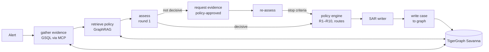

# Argus: a fraud investigator that knows when to ask

*Built for the TigerGraph Agentic Fraud Investigation challenge (Hacker House Goa, 2026)*

A bank's fraud model flags a $77 card-present purchase in a billing region the cardholder has never used, with a score of 0.61. Is it a cloned card, or someone on holiday?

A score can't answer that. An analyst answers it by looking at the card's history, whether the customer's normal spending carried on at home, whether other cards turned up in the same region that week, and what happened the last time this customer was flagged. Then they decide whether that's enough to act on, or whether to ring the customer first.

Argus is an agent that works through that process. It investigates each alert against a knowledge graph in TigerGraph and says how sure it is. When it isn't sure, it asks for evidence the bank's policy allows it to request, then updates its recommendation. Actions that need a human stay with a human. Every case is written back to the graph, so the next investigation can find it.

## The problem as the dataset frames it

The benchmark is built on the IEEE-CIS fraud data: 590,742 card transactions over six months, with every original Vesta column kept, and device records for online purchases. The yes/no fraud label has been removed. Each transaction instead carries a risk score from the bank's model, which is "often wrong in both directions". On top of that sit 5,565 closed investigations from July to October, a written fraud policy (14 actions, three approval routes and rules R1 to R10), five documented fraud patterns, and 20 alerts from November and December to investigate.

For each alert the agent produces three things: a case record, a suspicious activity report when the policy requires one, and the next best action with its approval route, both *before* and *after* any evidence it asked for.

Two lines in the dataset README shaped most of our design: "Half the cases are legitimate", and "Some cases can only be solved by asking what happened on *other* cards."

## Architecture

We split the work three ways, and kept to that split throughout:

- **The graph establishes facts.** Every behavioural signal comes from a GSQL query over TigerGraph: the card's baseline, the transactions around the alert, which devices it shares with whom, which cards appeared in a region for the first time, and which past cases are connected.
- **Code produces the numbers and the actions.** Features, confidence, the policy rules, approval routes and the SAR decision are deterministic Python. The LLM never picks an action or a route.
- **The LLM does the reasoning.** It reads a compact evidence brief (findings, not raw rows) and decides what the evidence means: which pattern, how likely fraud is, which transactions belong to the episode, and what to ask next. It also writes the case summary and the SAR narrative.

## How TigerGraph is used

**Schema.** Customer, Card, Transaction, DeviceProfile, EmailDomain and BillingRegion vertices, connected by `OWNS`, `MADE`, `FROM_DEVICE`, `BILLED_IN`, `PURCHASER_EMAIL` and `RECIPIENT_EMAIL` edges. There's also a `NEXT` edge linking each card's transactions in time order. Every edge has a reverse edge, so the agent can go from a device to every transaction made on it, and from there to every card.

The bank's history is loaded as `ClosedCase` vertices linked to their transactions, cards and patterns, with a vector embedding of the analyst notes. The agent's own investigations become `AgentCase` vertices, with their own edges and a summary embedding. (`Case` is a reserved word in GSQL, which we found out from a schema change that failed.)

Load check: all 13 vertex and edge counts matched the prepared row counts. That's 590,742 transactions, 14,318 cards, 9,706 device profiles and 576,424 `NEXT` edges.

**A detail that mattered: card IDs.** The cases refer to cards as `C01234-K1`, but the transaction file has no card ID column. We tried several ways of deriving them. The one that matches all 14,975 labelled transactions exactly: within each customer, a card is a distinct card network and type pair (`card4`, `card6`). The pair with both fields blank comes first, then the rest in sorted order. Getting this wrong would have quietly broken every answer file, because the validator rejects any ID that doesn't exist.

**Queries.** All nine are installed, and all are bounded in time so they only read data from before the alert:

| Query | What it answers |
|---|---|
| `card_profile` | What is normal for this card: amounts, channels, products, regions, devices |
| `card_activity` | Transactions in a window, each with its device, New/Found flag, proxy, match flags, and any prior case |
| `shared_devices` | Which devices this card used, **how common each one is across all cards**, and which other cards used them in the same window, with their fraud history |
| `region_newcomers` | Cards that appeared in a billing region for the first time this week |
| `similar_cases` | Closed cases linked through the same customer, a connected card or a rare shared device |
| `agent_case_memory` | The agent's own earlier cases, opened strictly before this alert |
| `case_vector_search`, `policy_search` | Vector search over case notes and over the policy, pattern and regulation text |
| `link_case` | Write-back: links a new case to its card, transactions, devices, pattern and similar cases |

The device-popularity count in `shared_devices` turned out to be essential. Device strings like `iOS Device | mobile safari` appear on hundreds of cards, so sharing one proves nothing. The agent only treats a shared device as a link between people when 60 or fewer cards have ever used it.

**GraphRAG.** The fraud policy and the five patterns are stored one rule per chunk, and 14 FinCEN, FFIEC and FATF documents are split into sentence-aligned chunks of about 1,000 characters. That's 1,172 `PolicyChunk` vertices with embeddings, linked to the patterns they describe. Search runs in several steps:
- vector search in TigerGraph, restricted to the relevant source, so 1,146 regulation chunks can't crowd out 26 policy chunks
- BM25 keyword search, which catches exact terms like `R5`, `BLOCK_CARD` and `FIN-2011-A016` that embeddings miss
- reciprocal rank fusion of the two lists, then a cross-encoder rerank

When the agent already knows which rule applies, it fetches that rule's text by ID instead of searching.

**MCP.** The agent reaches TigerGraph only through `tigergraph-mcp`, restricted twice:
- **on the server:** only 22 read and vector tools are offered, plus running installed queries
- **in the client:** every call is checked again, and installed queries are limited to the nine above

Tools that drop, clear, delete or run raw GSQL are never available to it.

## The agentic part: deciding when it knows enough

**Round 1** uses only graph evidence. The assessor (an LLM with structured output) returns a pattern, a verdict, a probability, how many independent signals support it, and whether the policy calls for more evidence. For example, R1 says "if the case rests on a single signal and probability is below 0.70, verify before you block."

**Requesting evidence.** The policy lets the agent, without approval, ask the cardholder, require step-up authentication, or ask an analyst. The dataset contains no replies, so a separate simulator component answers. It role-plays the cardholder from the account facts only and is never told the assessor's verdict. Its reply is recorded word for word in the answer file as the stated assumption, as the README requires.

**Re-assess, then stop.** The loop ends when one of these holds, and the reason is recorded:
1. the probability is at least 0.85 or at most 0.15, backed by at least two independent signals *and* a deterministic confidence score above a threshold
2. a reply settled the question
3. there's nothing new worth asking
4. the evidence budget has run out

Confidence combines three things: how much of the evidence surface actually returned data, how many independent signals agree, and whether similar past cases' outcomes agree with the verdict.

**Deciding.** A deterministic engine turns the round-1 assessment into the "before" actions and the final assessment into the "after" actions. It uses the exact identifiers and approval routes from the policy, including `BLOCK_CARD` being L1 up to $2,500 exposure and L2 above that. The SAR decision follows §3a: file only if fraud is confirmed or strongly suspected **and** at least one of these holds: exposure above $1,000, a link to a shared device, region or another customer's fraud, or an undocumented pattern.

Two cases show the loop working:

- **HHG-011**, a disputed $131.30 online charge from a device marked New. Round 1 was genuinely unsure (0.45): the card had two earlier charges of exactly $131.30, which could mean a subscription the customer forgot. The agent asked about those earlier charges, not just the flagged one. The simulated cardholder denied all three and any knowledge of the device, so the final verdict was fraud at 0.84 with `BLOCK_CARD` (L1). "Before" and "after" differ, and the answer file explains why.
- **HHG-001**, the $77 purchase from the opening paragraph. Region 444 was new for the card, but this card is used in person across many regions every week. The customer's normal spending continued at home within hours either side, and round 1 leaned legitimate at 0.30. Because the evidence still wasn't decisive, the agent verified with the customer instead of closing the alert: verify and open a case, but don't block. The simulated cardholder confirmed the purchase, which settled it at 0.06, so the transaction was allowed and the alert closed.

Not every case is that clean. In **HHG-003**, the customer disputed a $49.00 card-present charge that matched 56 earlier charges of the same amount, and came 49 minutes after a purchase the customer confirmed making in the same region. Even when asked, the simulated cardholder kept denying it. The agent weighed the recurring pattern against that denial, landed on legitimate at 0.35 under R7 (warn the customer, don't block), and closed the case. That's a defensible call, but a close one, and it's exactly the kind of case we'd want an analyst to see.

Across the 20 cases, the agent requested evidence in 17. In every one of them its recommendation changed between "before" and "after".

## Two patterns that aren't in the rulebook

The README warns that not every pattern in the data is documented. Argus found two, both through the graph:

- **A device ring (HHG-014).** An analyst asked about "an unusual device profile". `shared_devices` showed the card's one online purchase came from `SM-G935F | Android 7.0 | chrome 62.0 | 1920x1080` behind an anonymous proxy. That profile appears on 20 cards in the same month, many with confirmed fraud. `similar_cases` found four closed cases the bank had already marked `undocumented`, all with the same device. Each victim's normal in-person spending carried on at home. The agent described it as coordinated reuse of one device fingerprint to spread small charges across many stolen card numbers. It filed a SAR, placed 15 linked cards under monitoring, and escalated the case to an analyst.
- **Threshold probing (HHG-006).** Four online purchases between 20:00 and 20:30, at $478.95, $456.96, $488.04 and $482.12, on a card that is 97.5% card-present. The amounts look chosen to stay just under a $500 authorisation limit; five closed cases in the history match this. Exposure was $1,906.07, so a SAR was filed.

## The analyst console

The analyst console is built on the team's React/Expo frontend. It shows:
- a case queue
- for each case: how the probability moved (model score, round 1, round 2) against the policy's stop bands, the "before" and "after" action lists with the question asked and the reply received between them, the evidence with its sources, the investigation timeline, the SAR, and the case's own graph
- the knowledge graph for one case or all 20, drawn on a dark canvas where fraud cases, flagged transactions and shared devices pulse, and hovering over a node traces its connections
- a role switcher (analyst, team lead, fraud manager) that controls who can approve what; the server enforces the same rules and logs every approval with who made it and when

## Results

| | |
|---|---|
| Cases | 20; all valid against the answer format, and every ID exists in the dataset |
| Verdicts | 10 fraud, 10 legitimate |
| Patterns | `card_not_present_new_device` ×5, `card_not_present_fraud` ×3, `undocumented` ×2 |
| Reports | 5 SARs; every other fraud case states why no report is needed under §3a |
| Evidence requests | 17 cases, each with a different "after" recommendation |
| Per case | about 10 tool calls, a median of 29k tokens, about 79 s |

We don't have the answer key, so we can't report accuracy. What we can say is that every verdict, action and report decision traces back to a graph query, a policy rule or a recorded assumption.

## What we learned

- **Most of the fraud signal is in relationships, not transactions.** The strongest evidence was never "this amount is unusual". It was "this device has been on 20 cards this month, and four of them are closed fraud cases". That's a graph traversal, not a table scan.
- **Weight graph evidence by how rare it is.** Before we added device rarity, generic browser strings made every card look connected to hundreds of fraud cases. How common an entity is matters as much as the fact that it's shared.
- **Keep the LLM away from actions and routes.** Putting the policy in code made every action auditable, and made "the LLM chose to block" impossible by construction. The LLM's job is judging what the evidence means.
- **Make the model's IDs checkable.** The assessor may only cite transaction, card, device and case IDs present in its brief. We validate every returned ID and drop anything unknown, because an invented ID scores zero.
- **Calibration needs a guard.** We added a rule that a "fraud" verdict at probability 0.55 is downgraded to "uncertain", and wrote down why.
- **Practical surprises:**
  - a structured-output field named "private step-by-step analysis" was refused as a reasoning-extraction request; a short written justification works fine
  - TigerGraph's REST loader ignores `header="true"`, so our first load created a vertex whose ID was literally `id`
  - Savanna workspaces auto-stop in the middle of a session
  - free-tier LLM capacity can disappear for an hour, so the agent can now switch between Claude and Gemini and fall back across models

## What we'd do with more time

- **A real evidence-request channel** (SMS or app confirmation), in place of the simulator.
- **One model for all 20 cases.** Our API credits ran out mid-run, so 11 cases were produced with the evidence loop and 9 with the earlier single-pass agent.
- **Pattern detectors as installed GSQL queries.** We moved them to Python to iterate faster against the 20 cases; the next step is moving them back into the graph.
- **Continuous monitoring:** have the agent watch the November–December risk scores itself and open its own cases, which the README counts toward innovation.
- **Community detection over device, email and region subgraphs,** to surface rings before anyone asks.

---

*Stack: TigerGraph Savanna, GSQL, tigergraph-mcp, bge-small embeddings, BM25 with a MiniLM cross-encoder, Claude (with a Gemini fallback), FastAPI, React/Expo.*
